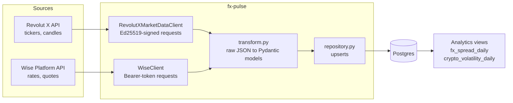

# fx-pulse

A small data pipeline that answers one question honestly: **what does moving money across currencies actually cost?**

It pulls two things into Postgres on a schedule:

- **Crypto market data** (tickers + candles) from [Revolut X](https://github.com/revolut-engineering/revolut-x-api), Revolut's crypto exchange API.
- **Cross-border transfer quotes** from [Wise's Platform API](https://docs.wise.com/api-docs) — both the mid-market reference rate and the actual rate/fee a customer would be quoted for a real transfer.

The gap between those two Wise numbers — the *quoted rate* vs. the *mid-market rate*, plus the explicit fee — is the effective markup a transfer costs. That's the number both Wise (built around "the true cost of sending money") and Revolut (cross-border spend, multi-currency accounts) care about communicating clearly to customers. `fx-pulse` turns it into a queryable time series instead of a one-off calculator.

## Why this exists

I'd already contributed a [bug fix](https://github.com/revolut-engineering/revolut-x-api/pull/78) and a [feature](https://github.com/revolut-engineering/revolut-x-api/pull/77) to Revolut's open-source `revolut-x-api`. This project extends that work in a direction relevant to graduate applications at both Revolut and Wise:

- It reuses `revolut-x-api`'s exact Ed25519 request-signing scheme, reimplemented in Python (see [`fxpulse/auth/signer.py`](src/fxpulse/auth/signer.py)) — same registered API key and keypair, two languages.
- It's a Python/SQL/Postgres data pipeline, matching what Revolut's Graduate Programme (Python track) actually asks for: "building well-designed, scalable APIs" and "creating data pipelines to support reporting, analytics, and data science."
- The subject matter — FX transparency — sits on Wise's core product thesis, not a generic CRUD demo.

## Architecture



Each layer is independently testable: `clients/` only knows HTTP, `pipeline/transform.py` is pure functions (raw dict in, Pydantic model out), `db/repository.py` only knows SQL, and `pipeline/ingest.py` wires them together via dependency injection — every ingestion function takes its clients/cursor as arguments, so the orchestration logic is tested with fakes (`tests/fakes.py`), no network or database required.

## Setup

**1. Install dependencies**

```bash
python -m venv .venv
.venv\Scripts\activate        # Windows
# source .venv/bin/activate   # macOS/Linux
pip install -e ".[dev]"
```

**2. Revolut X credentials**

fx-pulse reads the same config file `revolut-x-api`'s CLI writes:
`%APPDATA%\revolut-x\config.json` + `private.pem` (Windows) or `~/.config/revolut-x/` (macOS/Linux).
Run `revx auth setup` once (from `revolut-x-api`) and both tools share the same registered key.

**3. Wise sandbox credentials**

Register a free sandbox account at [sandbox.transferwise.tech](https://sandbox.transferwise.tech/), create a Personal Token, then:

```bash
cp .env.example .env
# edit .env: set WISE_API_TOKEN
```

> The Wise client's endpoint shapes (`/v1/rates`, `/v1/quotes`) come from Wise's public [api-docs repo](https://github.com/transferwise/api-docs) — their interactive docs site is a JS SPA I couldn't scrape directly while building this. Sanity-check response field names against your own sandbox account; `WiseClient` stores whatever it gets and `transform.fx_quote_from_raw` falls back to the `paymentOptions[0]` shape if the top-level `rate`/`fee`/`targetAmount` fields aren't present, so small drift shouldn't be fatal.

**4. Database**

```bash
docker compose up -d
fxpulse init-db
```

## Running it

```bash
fxpulse run --symbol BTC-USD --symbol ETH-USD --fx-pair GBP:EUR:1000 --fx-pair GBP:USD:1000
```

Then query the analytics views directly:

```sql
SELECT * FROM fx_spread_daily ORDER BY day DESC LIMIT 10;
SELECT * FROM crypto_volatility_daily ORDER BY day DESC LIMIT 10;
```

`fx_spread_daily` reports, per currency pair per day: sample count, average/min/max markup in basis points, and average implied fee percentage — the "how expensive is sending GBP->EUR trending" report. `crypto_volatility_daily` is a lightweight companion rollup from the Revolut X candle data.

## Testing

```bash
pytest -v      # 28 tests
ruff check .   # lint
mypy src       # strict type checking
```

Notably, `tests/test_signer.py` doesn't just check the Ed25519 signer runs — it verifies the exact byte-for-byte message format (`{timestamp}{METHOD}{path}{query}{body}`) by signing with a generated keypair and verifying the signature against the same message `revolut-x-api`'s TypeScript signer would produce, catching the class of bug where "the code runs" but the server would reject every request.

## Project layout

```
src/fxpulse/
  auth/           Ed25519 signing + private key loading (mirrors revolut-x-api)
  clients/        Revolut X and Wise HTTP clients
  pipeline/       transform (pure) + ingest (orchestration)
  db/             schema.sql + repository (plain SQL, no ORM)
  cli.py          `fxpulse init-db` / `fxpulse run`
tests/            28 tests: signer, transform, models, both clients, repository, ingest
.github/workflows/ci.yml   lint + typecheck + tests, plus a schema-apply check against real Postgres
```
